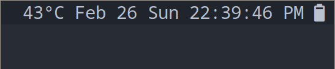

# Install
Currently, it only supports linux system

```elisp
(use-package emacs-cpu-temperature
  :straight (:host github :repo "zhenhua-wang/emacs-cpu-temperature")
  :config
  (setq cpu-temperature-update-interval 1
        cpu-temperature-termal-zone-type "x86_pkg_temp"
        cpu-temperature-termal-zone-path "/sys/class/thermal/")
  (add-to-list 'global-mode-string 'cpu-temperature-string t)
  (cpu-temperature-mode 1))
```

# example


